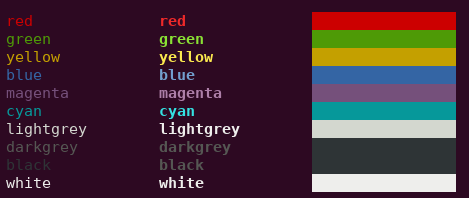

# tmlpy - Python implementation of Terminal Markup Language

A Python module to implement [tml](https://github.com/liamg/tml), which make the output of coloured/formatted text in the terminal easier and more readable.




## Usage in Python
First, install tmlpy:
```bash
pip install tmlpy
```

The output of coloured/formatted text is easy using the following syntax:

```python
from tmlpy import tml
tml.print("<red>this text is <bold>red</bold></red> ", "and the following is <green>%s</green>" % "not red", sep='')
```

## Format

Each tag is enclosed in angle brackets, much like HTML.

You can nest tags as deeply as you like.

It's not required to close tags you've opened, though it can make for easier reading.

### Available Tags

#### Foreground Colours

- `<red>`
- `<green>`
- `<yellow>`
- `<blue>`
- `<magenta>`
- `<cyan>`
- `<lightgrey>`
- `<darkgrey>`
- `<black>`
- `<white>`
- `<lightred>`
- `<lightgreen>`
- `<lightyellow>`
- `<lightblue>`
- `<lightmagenta>`
- `<lightcyan>`

#### Background Colours

- `<bg-red>`
- `<bg-green>`
- `<bg-yellow>`
- `<bg-blue>`
- `<bg-magenta>`
- `<bg-cyan>`
- `<bg-lightgrey>`
- `<bg-darkgrey>`
- `<bg-black>`
- `<bg-white>`
- `<bg-lightred>`
- `<bg-lightgreen>`
- `<bg-lightyellow>`
- `<bg-lightblue>`
- `<bg-lightmagenta>`
- `<bg-lightcyan>`

#### Attributes

- `<bold>`
- `<dim>`
- `<underline>`
- `<blink>`
- `<reverse>`
- `<hidden>`

#### Related

[https://github.com/liamg/tml](https://github.com/liamg/tml)